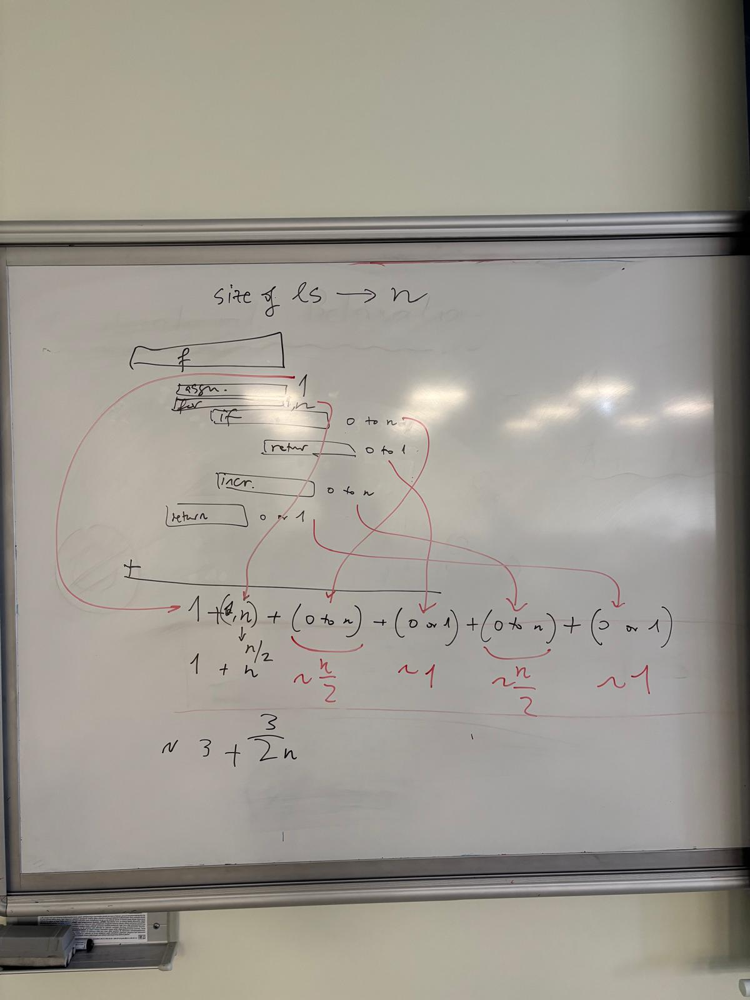

# LECTURE NOTES

## 26.02
Midtermde namespace sorusu kesin olacak.

## 03.03 4-1
Complexity

## 05.03 4-2
Hoca binary search anlattı. Complexity si logaritmik (log2 tabanında n)
big O için log basei önemli mi? Düşün Değil çünkü taban işlemleri ile asimptotik olarak aynı olduğunu gösterebiliriz.

### OBJECT ORIENTED PYTHON IMPLEMENTATION
#### Classes

Fonksiyon sadece çağrılınca kednine ait namespacei açılıyor ve execute edildikten sonra garbage collectora gider.
Class ile function arasındaki fark class içerisi execute ediliyor. Function çağrılana kadar edilmez. Ayroca class namespace function gibi kullanıldıktan sonra silinmez. 

***Çağrılmadığı müddetçe functionın namespacei yok, function call un namespacesi var.***

